# ServiceNow apps localization

## Goal

The goal of this lab is to describe the internationalization and localization
framework of the ServiceNow platform, demonstrate  how this applies to development
and localization of an app distributed on the ServiceNow platform and also to
discuss some of the best practices, gotchas, challenges and nuances of
delivering and deploying global apps.  

## Workshop dependencies
 * An available Instance and appropriate credentials
 * `I18N: Internationalization` plugin
 * `I18N: Internationalization Translation helper` plugin
 * An installed language plugin (can take 3-4 hours to install if not pre-installed)
 * Access to or pre-application of the `K19_Localization_Demo.xml` update set [Available here](https://github.com/GaryRCondon/ServiceNowAppLocalization/blob/master/K19_Localization_Demo.xml)

## Section 1: Introduction to ServiceNow i18n features

### Section Goal:
In this section we will verify that we have a language plugin installed and associated dependencies, create a simple application that demonstrates some of the ServiceNow Platform internationalization features (specifically the language tables) and take a look at our application from the perspective of another locale.

1. Navigate to the unique instance URL provided to you.

1. Log into your instance and verify that you have a language plugin installed
  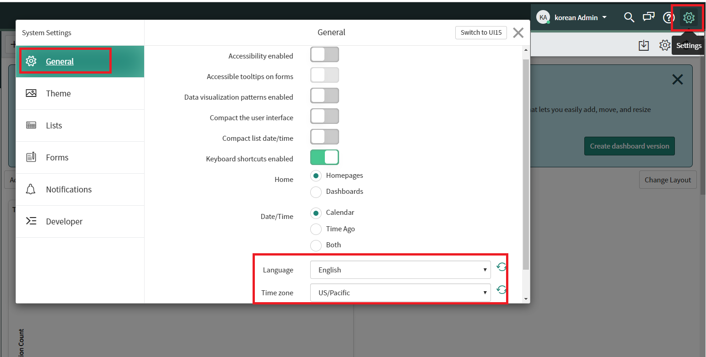

1. If you have a language plugin installed, you will already have the Internationalization plugin enabled (com.glide.i18n). For the purposes of the workshop, we will use the I18N: Internationalization Translation helper, so lets check if it is enabled.
1. Go to Plugins in the Filter navigator, and search for plugins.  In the Plugin search window, search for 'i18n'.
1. Make sure you have your chosen language (in our case French), as well as the i18n plugins referenced here:
  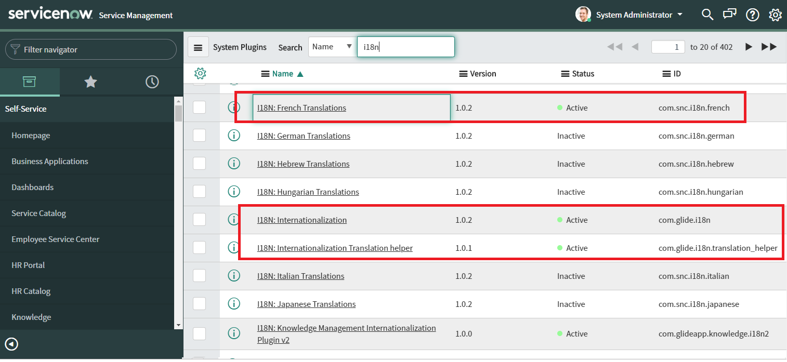

1. Now that we know we have the relevant plugins, we're going to create our App in Studio.

1. From Studio, [Create Custom Application]
  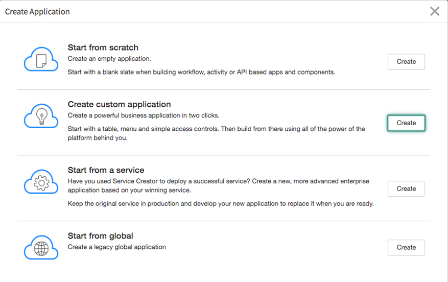

1. Add a single "Waiting Room" table.
  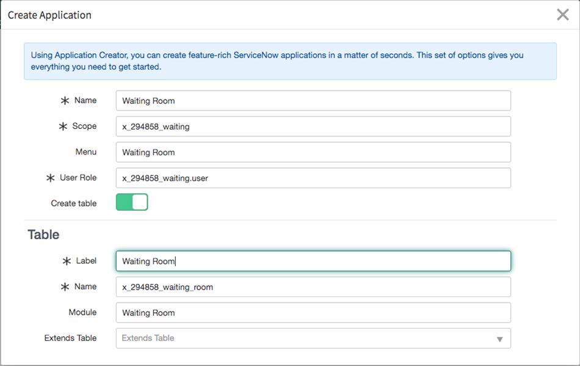

1. Click on the "Waiting Room" table to edit it
  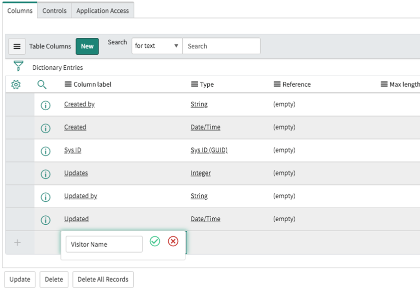

1. Add the fields as listed in the screenshot below, selecting the appropriate field type.
  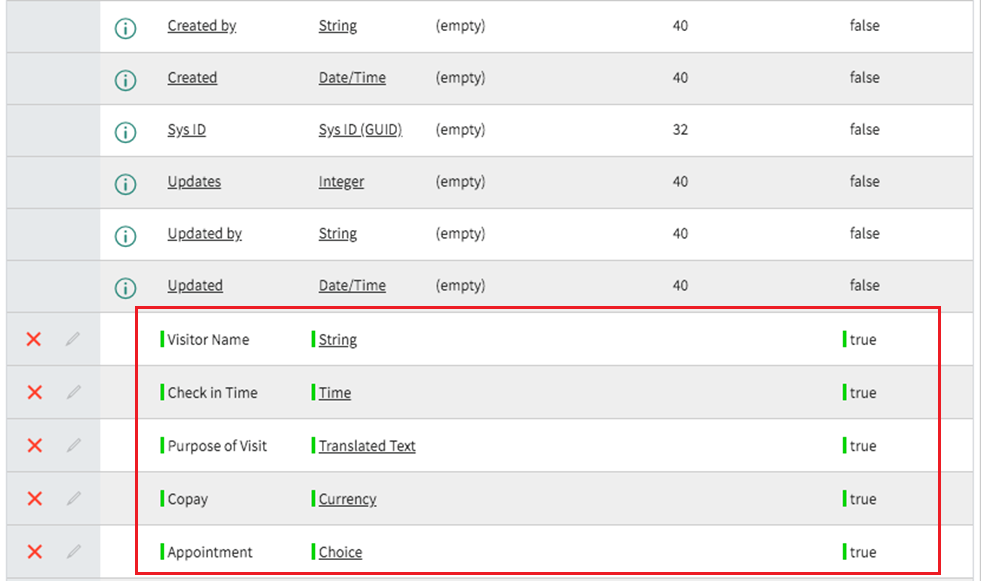

1. Edit the [Appointment] field, click on the [Choices] tab, and add the two values as show in the screenshot.
  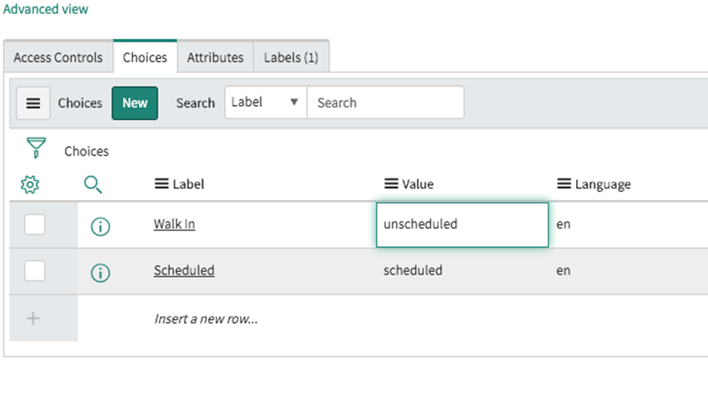

1. Refresh the app and find the 'Waiting Room' App menu and select it.
  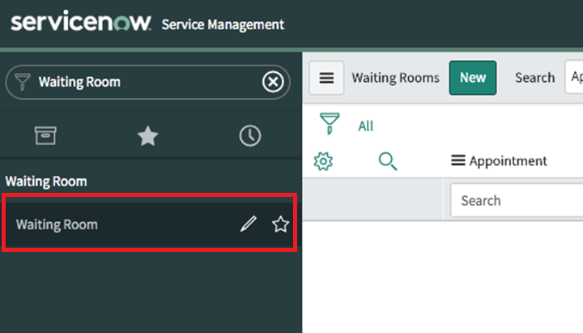

1. Click "New" to create a new entry       
  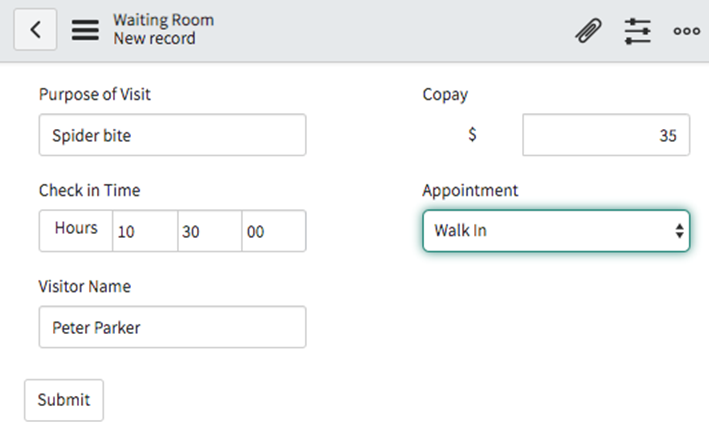

1. Now let's swap language and see how our app looks.  
  

1. As you can see, 'system-defined' or OOTB text is translated, but none of the fields in our new app are translated.
  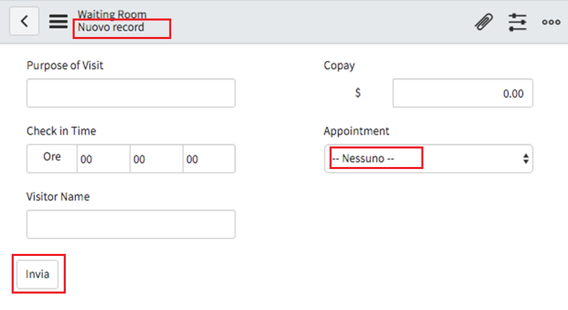

## Section 2: Export and translate the UI features

### Section Goal:
Here we will demonstrate how to locate your app's UI features in the localization tables, export and 'translate' your App's UI features, import and transform the translated fields back into your application, and take another look at your application in another locale.

1. From the Navigator, type [System Localization] and from the sub-menu, select [Field Labels]
  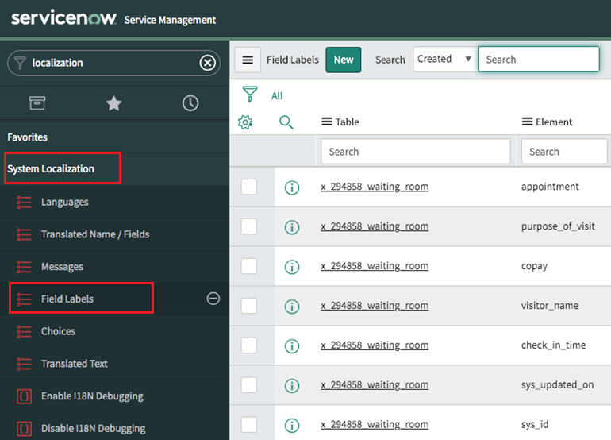

1. Filter on the new [Waiting Room] table.
  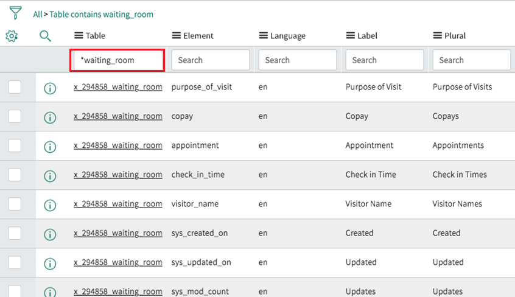

1. Export the filtered list.  Right-Click above the table, select [Export] and [Excel (.xls)].  Select a location and save the document.

  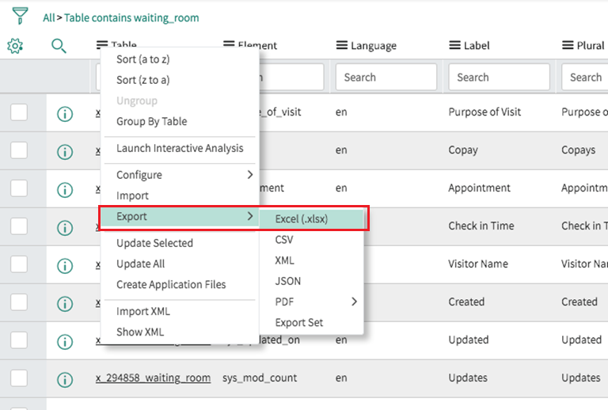

1. We're going to perform a quick 'fake' translation of the exported values, so open the spreadsheet in your favorite editing application, update the language field so that it matches the two letter ServiceNow language code.  Edit the relevant fields (in the case of Field Labels, you need to edit the: Language, Label, Plural, Help and Hint columns as appropriate.  Remember to save the document!
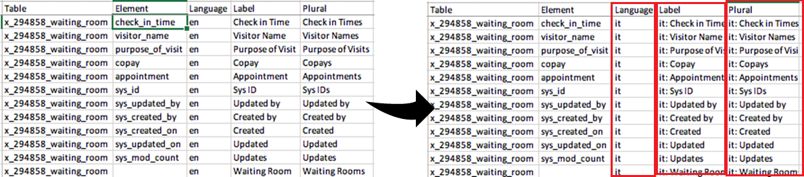  

1. Some quick options to 'fake translate' your values using Excel formulas:

    Option 1: Quick and dirty: 'This will pre-pend a value like `it -` before each of your values
     `=concat("it -", D2)`

     Option 2: A little more complex vowel substitution, convenient for visual testing.  Yields results like: `Knówlédgé Vérsíóns` `=SUBSTITUTE(SUBSTITUTE(SUBSTITUTE(SUBSTITUTE(SUBSTITUTE(SUBSTITUTE(SUBSTITUTE(SUBSTITUTE(SUBSTITUTE(SUBSTITUTE(A2,"a","á"),"e","é"),"i","í"),"o","ó"),"u","ú"),"A","Á"),"E","É"),"I","Í"),"O","Ó"),"U","Ú")`

   Option 3: Just edit each string and make a few simple changes!  If using an Excel formula, remember to paste the resulting value 'as-a-value'.

1. Now we're going to import our new translations back into our Instance.  From the [System Import Sets] menu, select the [Load Data] sub-menu.  Make sure you select the correct [Import Set Table].
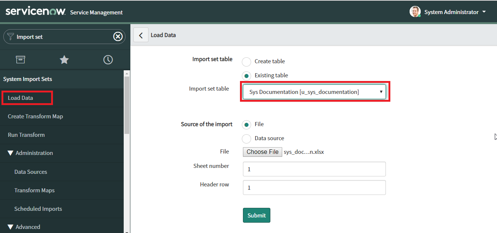

1. Once our import has completed successfully, we need to perform a transformation.  Select [Run Transform] from the resulting 'Success' window.
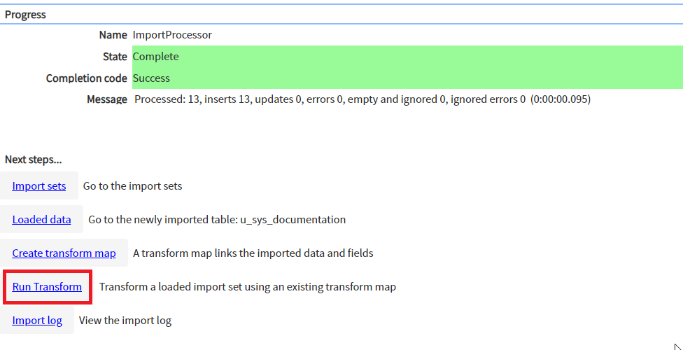

1. Make sure you select the correct Import Set if you are working with multiple import sets and select [Transform].
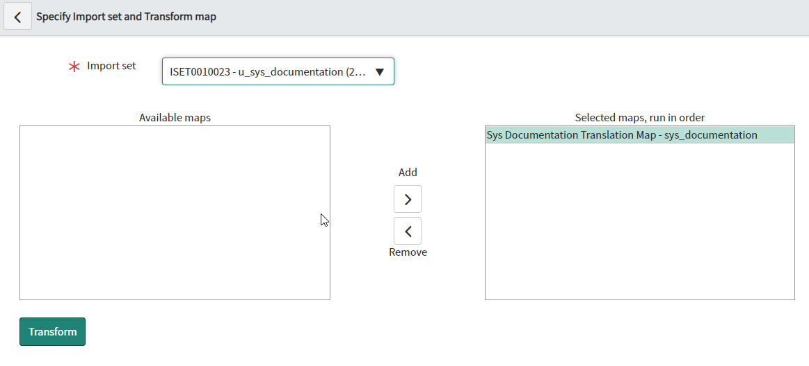

1. After completing the import and transformation, view the app and create another record.  Fields are now translated.
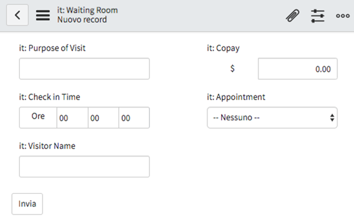

1. Repeat the process for other field types, specifically:
 * choices
 * translated text
 * Translated Name / Fields
 * Messages - Though our next section focusses a little more specifically on this area.

## Section 3: Translate a UI Page

### Section Goal:
Managing dynamic strings or user messages is a little different, so in this section we're going to focus on this area, creating a simple UI page, externalizing the strings to make them available for translation, and showing you how to manage translations for these UI elements.

1. Create a simple new UI page.  Return to your [Waiting Room] app in [Studio] and from the [Create Application File], select [Forms and UI] and [UI Page] and click on [Create].
  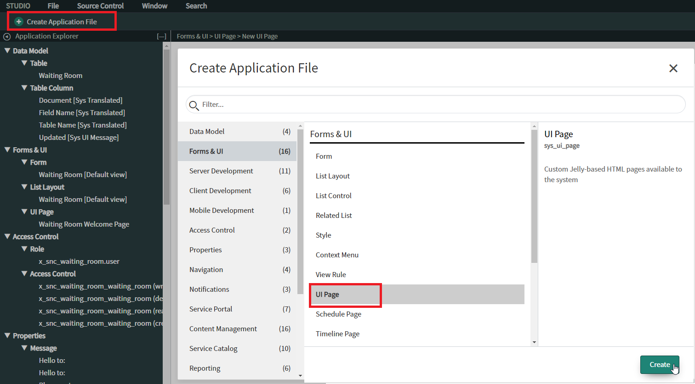

1. Insert some simple HTML with plain text messages.  If you like, just copy and paste the following text in between the opening/closing HTML tags:

`<body bgcolor="${background}" text="#FFFFFF">`

`<h1>Welcome to the Las Vegas Waiting room.</h1>`

`<h2>Please sign-in and take a seat</h2>`

`</body>`

Your HTML section should look something like this:
  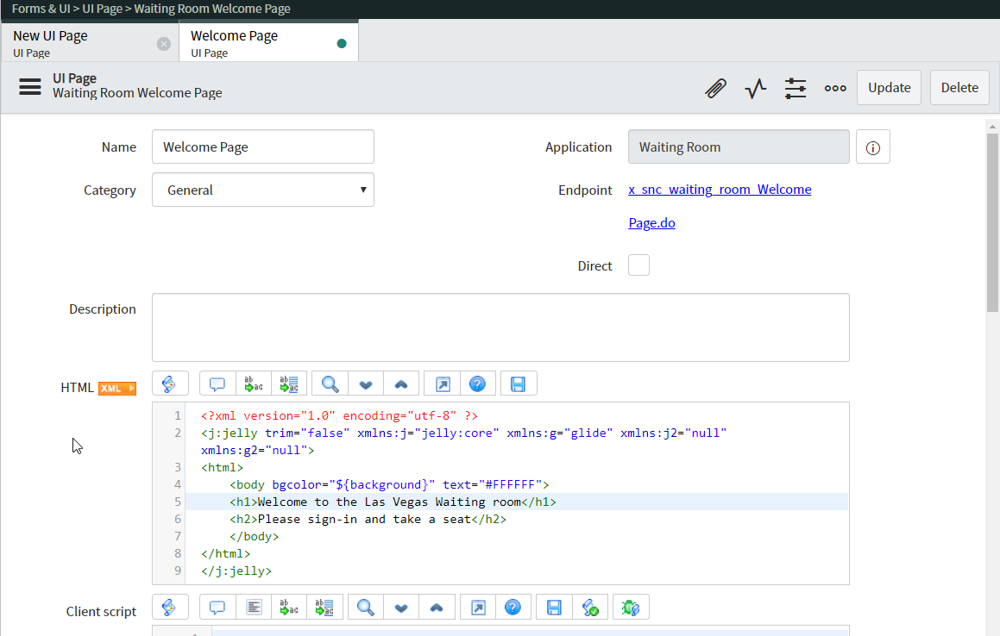

1. Change locale and click on [Try It] or click on the Endpoint Links
  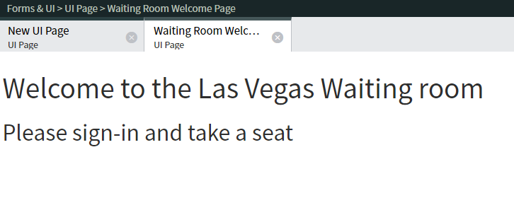
1. Not unexpectedly, nothing is translated.  We need to wrap the translatable user-facing text in `getMessage` calls and we also need to create and translate the associated key/values in the sys_ui_message table.
1. Firstly, update the text in the HTML Panel of your UI Page, to wrap the text in 'getMessage' wrappers, or just copy the following and replace the existing code in the HTML panel:

  `<h1>${gs.getMessage("Welcome to the Las Vegas Waiting room")}</h1>`

  `<h2>${gs.getMessage("Please sign-in and take a seat")}</h2>`

1. Your HTML section should now look like this:
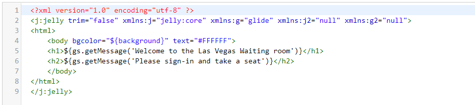

1. Now we need to create the English key and value in the sys_ui_message table.

**Best Practice:  Create the English (source language) key and value pair in sys_ui_message, to support easier exporting, translation and maintenance of mutli-lingual apps and solutions**

8. Return to your Instance, and navigate to [System Localization] and select the [Messages] sub-menu.  Click on [New] to create a new key/value pair.  Insert the text you wrapped in the `getMessage` call into the key field and the Message field.  
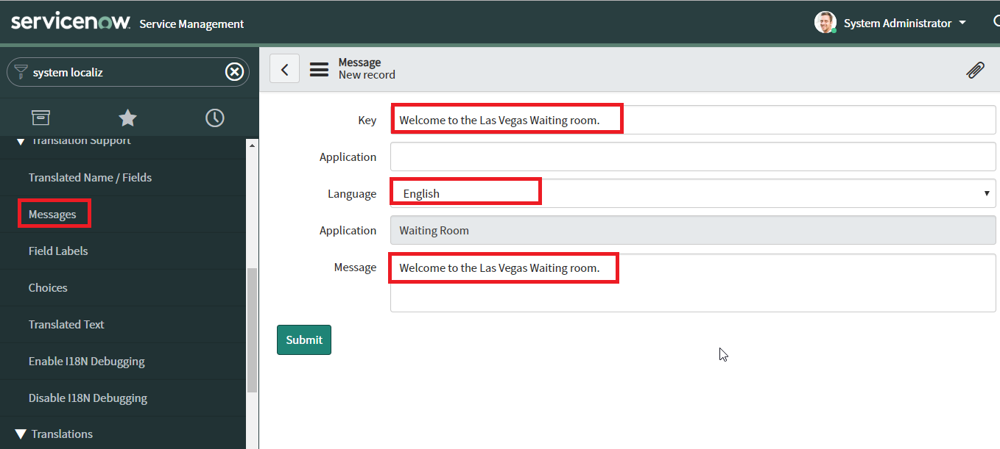

1. Repeat this step and create a key/message pair for the second string in your UI Page, specifically: `Please sign-in and take a seat`.

**Best Practice: Because the key/value pair is 'keyed' on the source string, if you change the text in your source code, you must make the corresponding change the key, otherwise you will have disassociated the text in the `getMessage` call from the key/value pair.**

1. Now we can either follow the process outlined in **[Section 2: Export and translate the UI features]**, but in the interest of expediency, we're going to simply create the corresponding key/value pairs for our target language directly in the sys_ui_message table.

1. Create a new key/value pair for our UI strings once again, however, this time select your target language from the [Language] drop-down and instead of inserting the same English message, insert something that will be immediately recognizable, for instance:
`Wélcómé tó thé Lás Végás Wáítíng róóm`.  Remember, the key should remain exactly as it appears in the `getMessage` call.

1. Your translated record should look like the following:
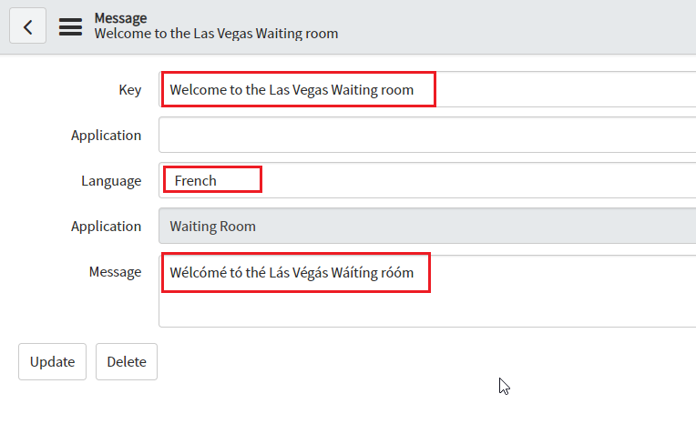

1. Repeat the process again for your second UI message, again, keeping the key the same, selecting your preferred language, and updating the value, with something like: `Pléásé sígn-ín ánd táké á séát`

1. Return to your UI Page in the Studio.  In the main ServiceNow Instance Window change your locale, and then either hit the [Try It] button in Studio, or click on the [Endpoint] URL.  Hopefully, you're now presented with a 'fake translated' UI Page!
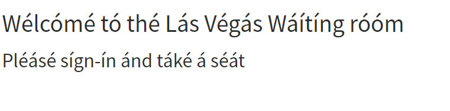

> **Best Practices:**

> If your UI page is not showing up translated, check the following items:
> * Make sure that the string wrapped in the `getMessage` call is the same as the string used in the key in the sys_ui_message table.
> * If you are exporting your app entries from sys_ui_message to translate them, make sure you have created English keys for all of your User-Interface strings, otherwise they will not be part of the export.  
> * Also make sure that all user-facing strings are wrapped in the appropriate `getMessage`/externalization calls.

## Section 4: Translate a Portal Widget

### Section Goal:
Here, we are going to take what we learned from the previous section and apply it to the process of managing the translations for a service Portal widget.  We'll take a look at some of the sample widgets included out of the box in a ServiceNow instance, and show you how to manage translations for user-facing translatable elements.

Following on from the translation of the custom UI page, let's take a look at the changes involved in translating a Service Portal Widget.  
1. Go to [Service Portal Configuration], [Widget Editor], Select the [Hello World 1] widget.
1. Preview the widget – Switch your locale to French ([Profile] [Language] [Refresh])
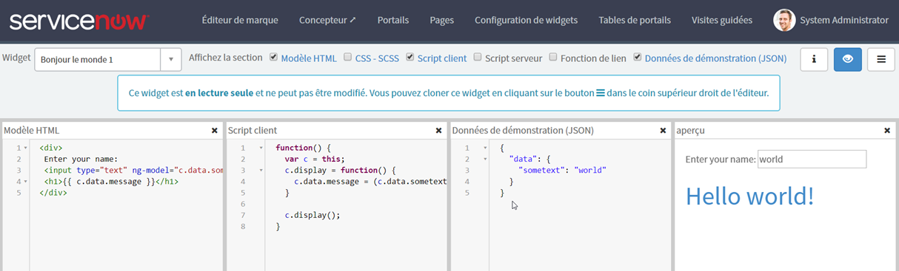

1. As you can see, the Widget name has been translated (from the 'out-of-the-box' language plugin) all of our widget text remains in English.  

1. Let's switch back to English.  How many hard-coded strings can you count?
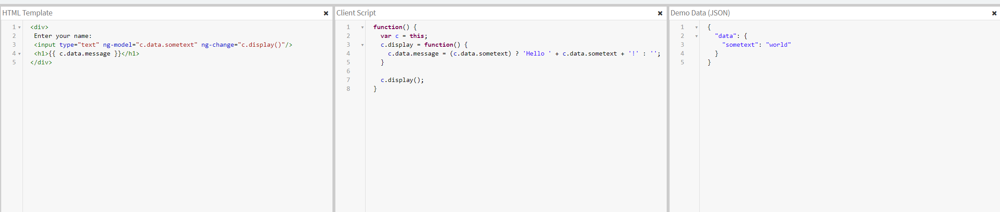

1. Technically, the answer is 4. Strictly speaking the demo data within the JSON is not hard-coded, but if it is used as a default value within client facing user content, then it too fits the bill.
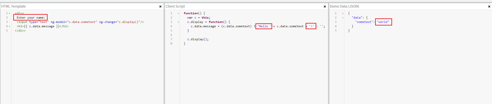
** Best Practice:  If you want your user interface elements to switch dynamically based on a user's preferred locale, don't store values in a non-internationalized structure like demo-data, unless you want to manually manage the dynamic switching **

1.  Now that we know what the problems are, let's fix them.  OOTB widgets are read-only, and we're going to make some changes, so let's clone the widget and call the new widget a very original 'Hello World 4'.
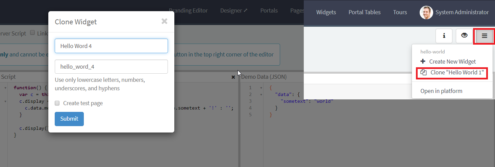

1. Firstly, let's externalize the text in HTML Template, by wrapping it in ${some text for translation}.
1. While we're art it, let's add another string, which we'll keep hard-coded, for comparison.  So your HTML Template should look like the following: 

`
`

`  ${Please enter your name:}`

`  
This is hard-coded text
` 

`...`

`
`

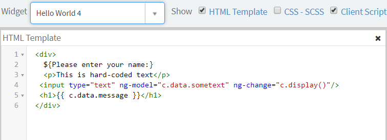

1. Next we'll fix up the Client Script.  Add a new variable and assign it with the formerly hard-coded text, andf while we're at it, wrap it in an externalization call, like the following: `	c.welcomemessage = "${Hello to: }"` and substitute the previous body of text with our new variable:

 `c.data.message = (c.data.sometext) ? c.welcomemessage	+ c.data.sometext + '!' : '';`
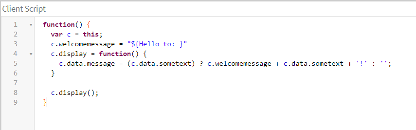

1. Finally, just for good measure, we'll update the JSON demo data.  Change it to `		"sometext": "le monde"`.  It's still hard-coded (won't change dynamically based on user locale), but for the purposes of our workshop, at least it's not in English.

1. Let's click on [Preview] (the eye icon).  
** Quiz: ** Why has nothing changed?
 * Well, we haven't changed our locale to something other than English.
 * We also have not yet created the required keys in sys_ui_message.
 * We also haven't provided any translations.  So let's do that quickly now.

 1. Navigate to the Message table [sys_ui_message] and create the English and translated keys:
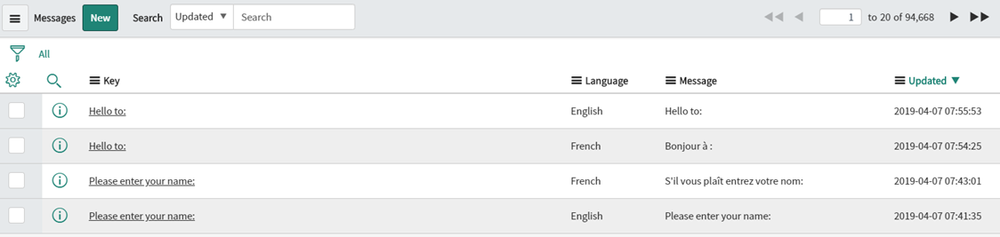

** Best Practice: ** Do we really need to create the English keys?  Aren't they available in the code?
 Better to create the English keys, so that if you later add a further language and perform an export you will be exporting all of the key/strings you need.

1. Return to [Widget Editor].  Switch your language, and open [Preview].  Fix bugs if necessary.  Happy days!
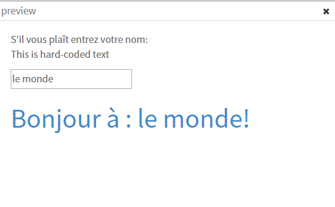

** Best Practices: **
 * Client Script uses a concatenated string:   <Hello to: > + <monde/input text> + <!>.  Simple example, but concatenated strings may not be translatable in all locales (language syntax).
 * Messages with quotes or double-quotes may cause javascript errors in client script, so best to assign value in server script then assign using angular binding.

1. Based on that last Best Practice, let's take one last look at Portal Widget Localization, this time using server-side script to retrieve our localized value then assign it to the client side in an Angular binding.

1. Here we've cloned the Hello World -3 widget (which contains server-side script), and made the same changes internationalizaiton changes.  This time we've assigned the string to a variable in the server-script variable `data.welcomestring`.  Note the apostrophe in the source string.  We created the required keys in English and French, and you can see it works as expected.  
 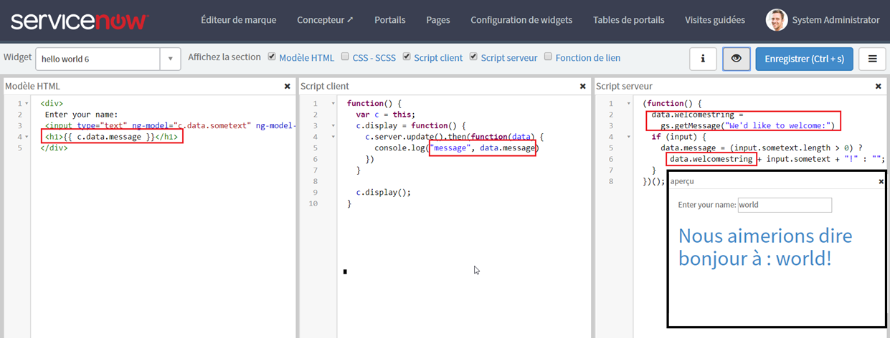

## Section 5: TranslationLoader Script Include

### Section Goal:
In this section, we're going to move away from our app for a little while, to look at more automated mechanisms for managing the flow of translations, specifically leveraging a pre-existing 'script include', exporting the resulting records, and showing you how to re-import these, via means of some data sources and transform maps we created for the demonstration.

TranslationLoader is a 'script include' (available out of the box), that expedites the process of gathering translatable content from the translation tables and streamlines the process of extracting and re-importing this content.  The Excel spreadsheets generated as an output of this process are not structured in the same manner as a typical table export.  As such, you need to create Import Set Data Sources, transform maps to consume the translated content back into your instance into the required language fields in the language tables.

For the purposes of this workshop, we have created an 'update set' that you can import and apply to your instance, that implements the following changes to your instance:
 * Updates the TranslationLoader script: Running the script on a clean zBoot'ed instance will take 3-4 hours so we have edited the script so that it only extracts table entries from the relevant fields that were created today (or more specifically on the day you run the script).
  * Creates data sources, to which you would attach your translated spreadsheets.
  * Creates transform maps that script the process of mapping the spreadsheet columns to table fields.
  * Adds sys_id as a column in the translated text list view.  This is required during the translation re-import.

### To Import and Apply the Update set (if it hasn't been pre-applied to your instance)
1. Navigate to the GIT Repository: [ServiceNowEvents GIT Repository](https://github.com/servicenowevents) and grab the updated TranslationLoader script.

1. Navigate to [System Update Sets] [Retrieve Updated Sets] and click on the link for [Import Update Sets from XML].
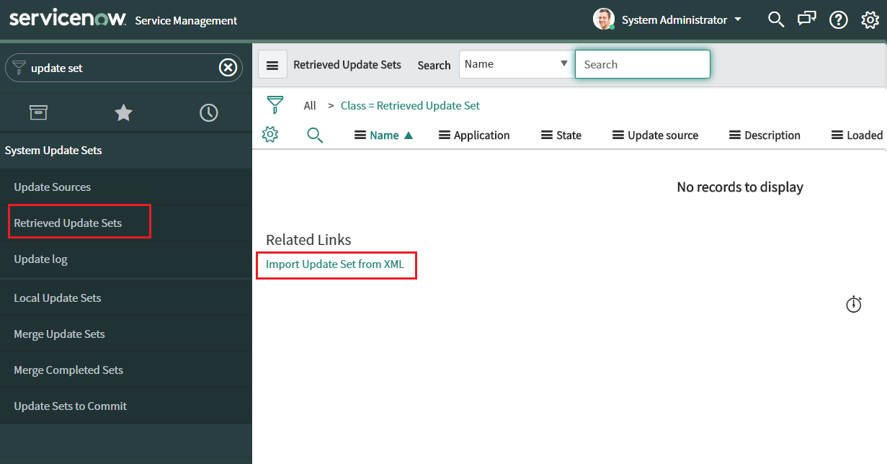

1. Choose the location where you saved the K19_Localization_Demo.xml update set, and upload it.

1. Return to [Retrieved Update Sets], [Preview] your update set and asusming there are no conflicts, [Commit Update set].
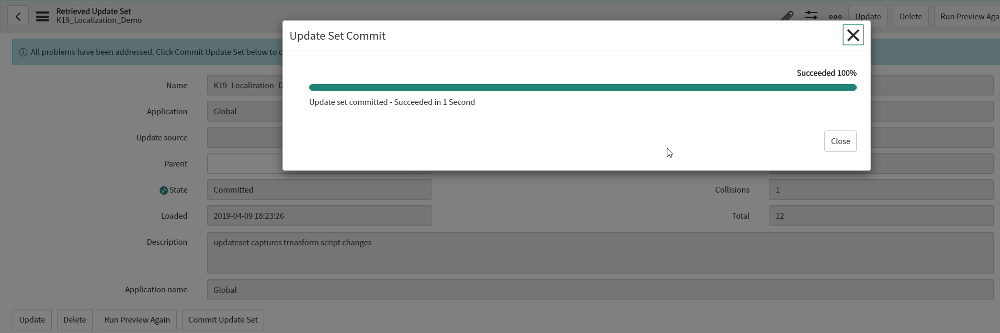

### Executing the TranslationLoader Script

** Dependancy: The TranslationLoader script include has a dependency on the `I18N: Internationalization Translation helper plugin` so please make sure you have this installed before trying to run the script. **

** Best Practice: **
The TranslationLoader script takes approximately 3-4 hours to run on a clean zBoot'ed instance, so don't attempt this unless you are using the modified script, or you have time on your hands!

1. Navigate to the [System UI] [Script Includes], find the TranslationLoader script and either update it with our edited script or create a new Script include.
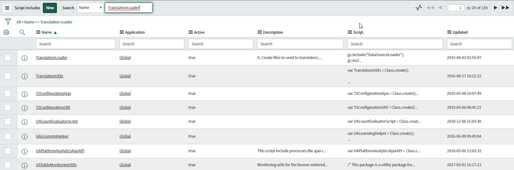

1. Run the amended script in Global scope:
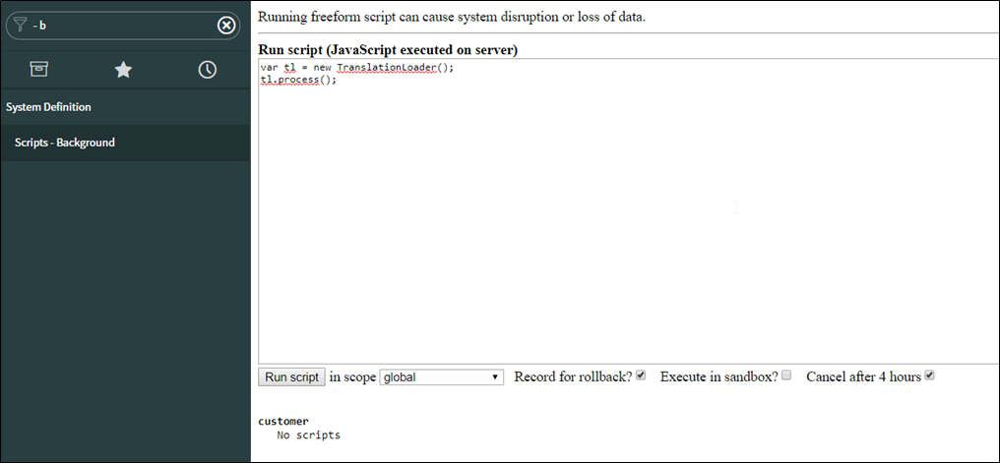

1. Script will eventually return the consolidation/extraction results:
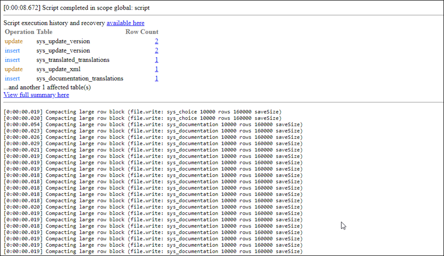

1. Navigate to each of the tables:
 * Translated Name / Field Translations
 * Message Translations
 * Field Labels Translations
 * Choice Translations
 * Translated Text Translations

1. Filter the required fields and export.
 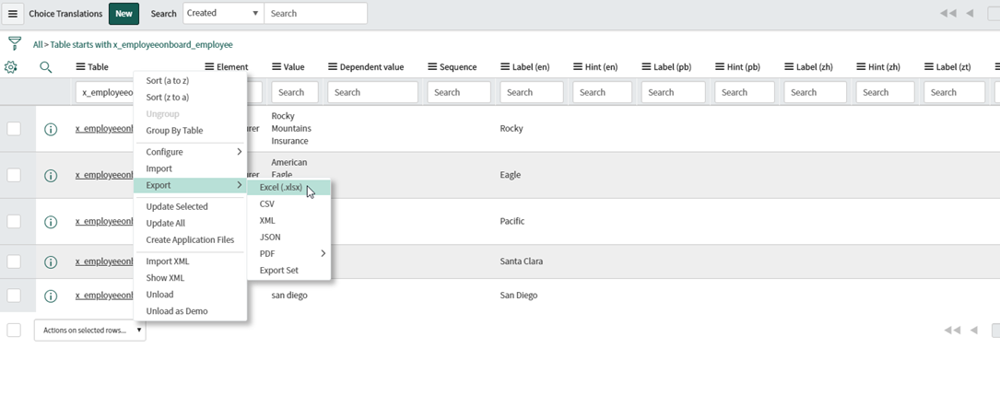

1. Note: the exported spreadsheet format differs from the standard table export, with column corresponding to the source, for each of the target languages.

 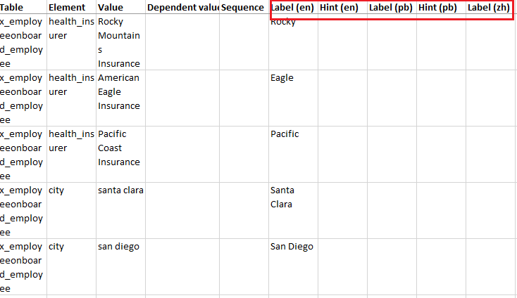

 ** Best Practice: If you haven't imported and applied the update set we created for this workshop and you are exporting/re-importing from the table `Translated Text Translations` you will need to re-configure the table view to include the column `Document Sys ID`.  This column provides the unique key reference required to successfully re-import the translated records.  **

1. Translate the values corresponding to your desired target locales and save the spreadsheet.

1. Navigate to [System Import Sets] and [Data Sources] and choose the data source we created for you that aligns with the table you are translating (in this case, sys_choice - therefore Choice_Translated)
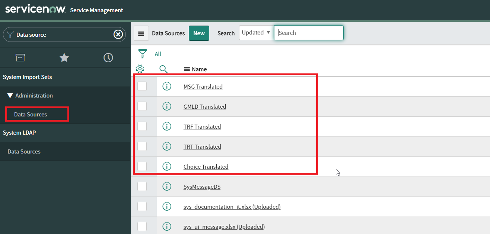

1. If you are not in the global scope, click on the cog-wheel in the ribbon bar, and from the [Developer] tab, and from the [Application] drop-down list select [Global] scope.
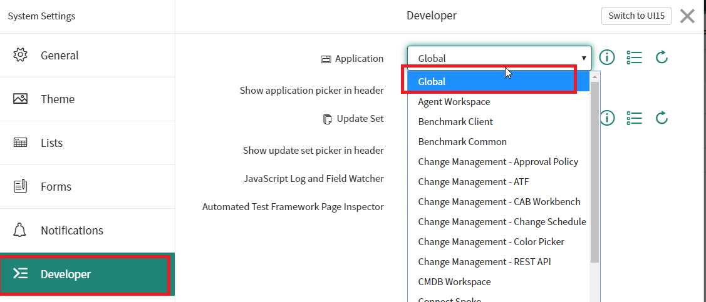

1. Attach your translated spreadsheet to the data source and click on [Load All Records].  
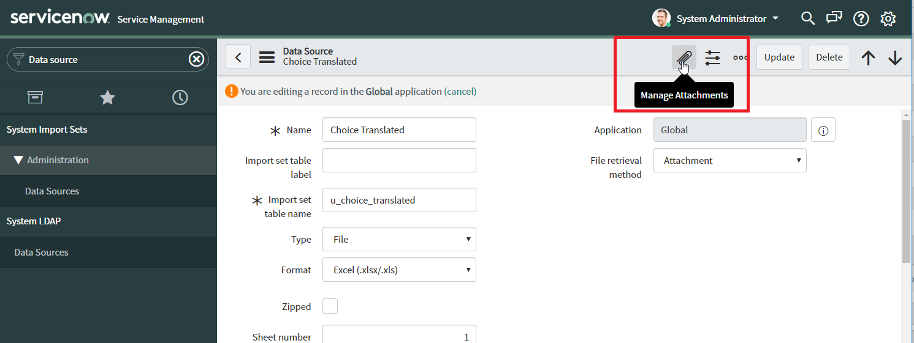

1. From the Import Success message screen, select [Run Transform].  Make sure the correct [Import set] and [Transform map] are selected, and click on [Transform].

1. If everything goes to plan, revisit your original translation table (in this case [Choices]), sort by created date, and you should see your imported choice records.
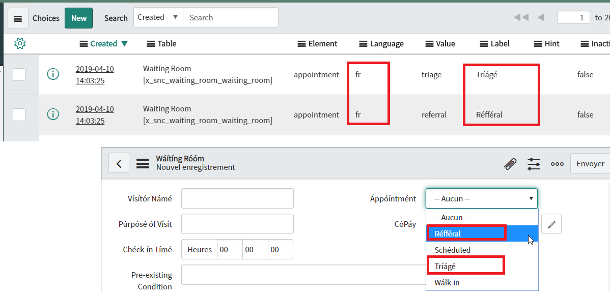     

### Some final notes on the TranslationLoader scripts and update Sets
 * While the TranslationLoader script is out of the box, we have made modifications to only read new translation records added on today's date.
 * The import set creates Data sources and Transformations, to import translated records created after running the TranslationLoader.
 * In our example, the [Data Sources] we created are configured to import only from Italian and French columns in the spreadsheet and import into those languages in your instance.
 * If you want to import other languages, you can create a unique [Data Source] for each language, or if you want to use our modified update set, you can add the [Properties] column in [Data Sources] list view, and modify the language list associated with each of the [Data Sources] we created.
 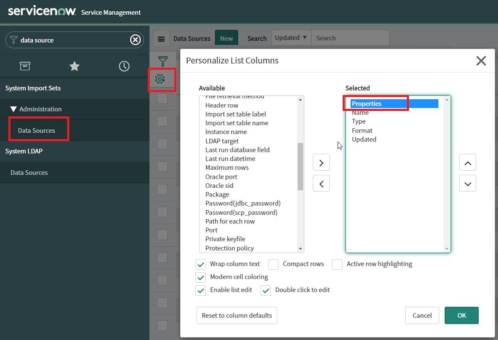    

 * In this example, you can see we have exposed the [Property] column, and added Spanish support to the MSG Translated [Data source].  The next time we import an Excel spreadsheet generated using the TranslationLoader script, and import it using the MSG Translated data source, the Spanish column will be imported, alongside the French and Italian translated records.
 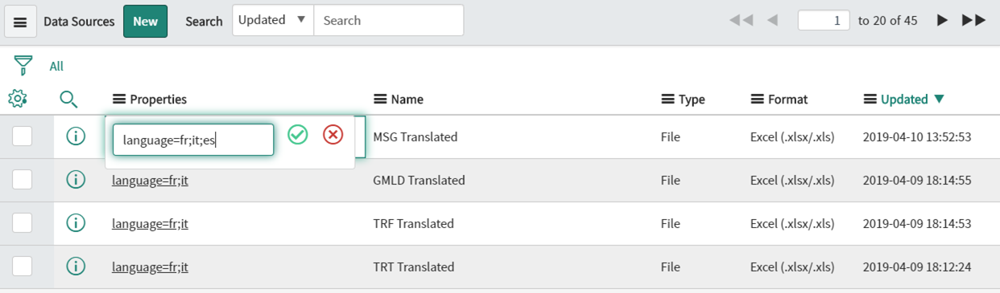

## Section 6: Lessons learned from internationalization of the DevOps Application
The DevOps app presented an interesting opportunity for us, as it is a standalone release, with no pre-existing distribution as part of a family release.  As such, we could not leverage the typical automation steps we used to analyze the DevOps content, extract translatable content in an automated fashion, and release it as part of a family release language plugin.  In effect we had to perform these tasks much as our customers do, using the standard features of the platform.

### The good
The team developing the DevOps application, are thankfully well-versed in the realm of developing properly internationalized products and generally speaking, we encountered few issues during the internationalization testing phase of the project.
 * User-facing UI elements (for the most part) used translatable field types
 * User-facing messages were wrapped in exnternalization wrappers (e.g. gs.getMessage)
 * The code/logic did not make assumptions about string language values (references to English strings)
 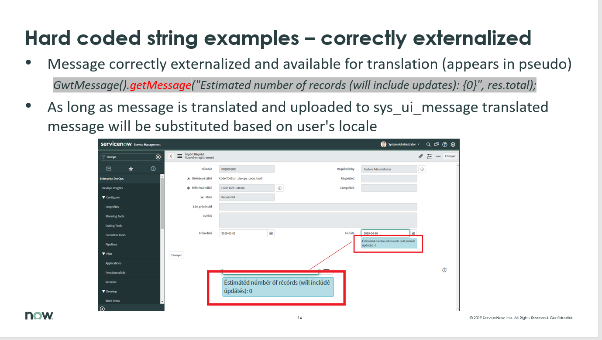

### The Bad
It can be challenging to identify every single occurrence of a user-facing string, which is where the usefulness of internationalization testing comes into play.  After extractions, we perform 'pseudo' or 'fake' translation and testing, much as we did earlier in the workshop.  This effort highlighted some strings that had not been identified as user-facing and were not suitably wrapped in `getMessage` methods.  Here are some of those examples:

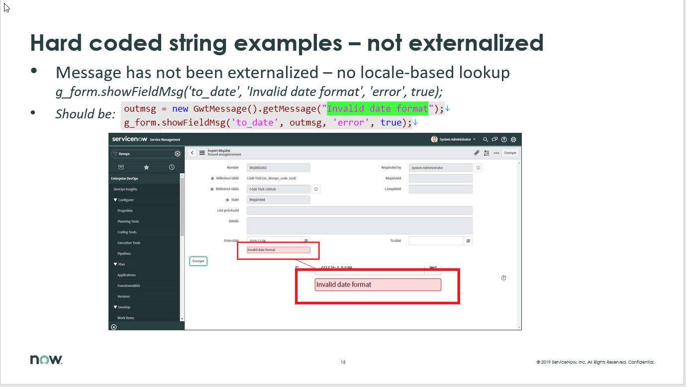
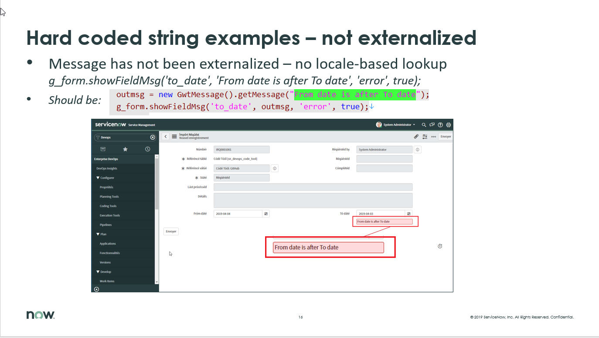
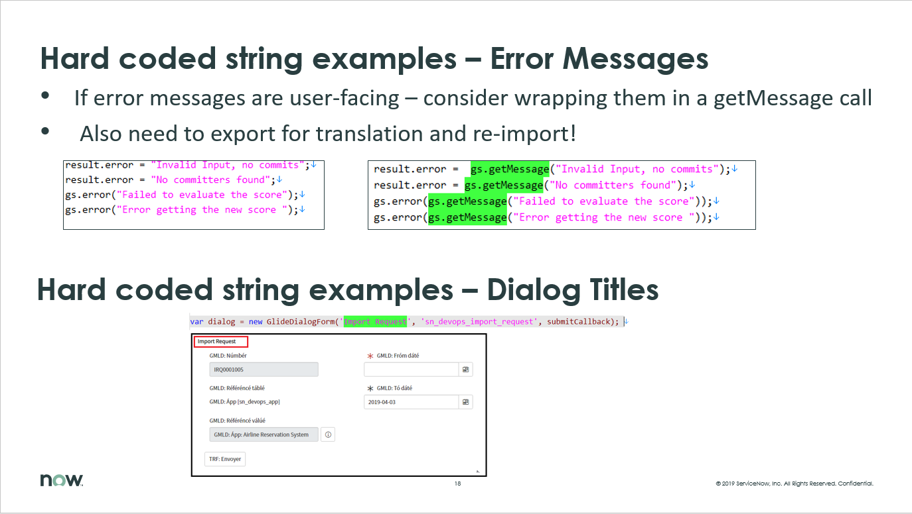

### The Ugly
The final example we have for you, is potentially the worst kind - where the code makes determinations or logical assignment based on an assumed static (English) user interface. In these examples they can affect the functionality of an application when those interrogated values are translated.  Again, this highlights the important of an internationalization review and testing phase.  
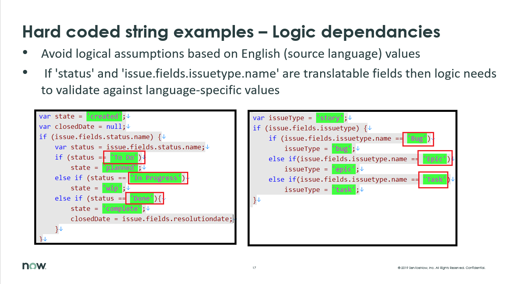

## Wrap-up
Thank you for taking the time to participate in our ServiceNow Apps localization break-out session/workshop.  If you had any problems accessing or following this script or have any follow-up questions we'll be here for a while after the session concludes, so please reach out to us and we'd be happy to help.
